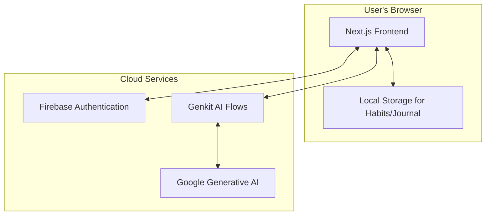

<div align="center">

**<h1>Unwinding: A Personal Wellness Sanctuary</h1>**

**[Your Name]**  
**Roll No.:** [Your Roll No.]  
**Course:** [Your Course]  
**Guide:** [Your Guide's Name]  
**Semester:** [Your Semester]  
**Institution:** [Your Institution]  
**Submission Date:** October 26, 2023

</div>

---

### **Abstract**

The Unwinding project aims to develop a comprehensive personal wellness sanctuary in the form of a web application. The primary objective is to provide users with a private, secure, and integrated platform for cultivating mindfulness, building healthy habits, and reflecting on their emotional well-being. The methodology involves using a modern web stack, including Next.js for the frontend, Firebase for authentication and backend services, and Google's Genkit for integrating generative AI features. The main result is a functional application featuring a mindful journaling system with AI-powered analysis, a habit tracker, a guided meditation space, and AI-generated daily reflection prompts. The application prioritizes user privacy by leveraging local storage for sensitive data, ensuring a personalized and secure user experience.

**Keywords**: Mental Wellness, Mindfulness, Next.js, Firebase, Generative AI.

---

### **1. Introduction / Background**

In today's fast-paced world, maintaining mental well-being is more critical than ever. Many individuals seek tools to manage stress, cultivate positive habits, and engage in self-reflection. While numerous digital wellness applications exist, they are often fragmented, lack personalization, or raise privacy concerns. The Unwinding application is designed to address these gaps by providing an all-in-one, private sanctuary for mental wellness, leveraging modern technology to create a supportive and engaging user experience.

### **2. Problem Statement**

There is a need for a private, user-centric, and comprehensive digital tool that integrates key wellness practices—such as journaling, habit tracking, and meditation—with personalized, AI-driven insights, without compromising user data security.

### **3. Objectives**

The primary objectives of this project are to:
*   Develop a secure web application with user authentication using Firebase.
*   Implement a mindful journaling feature that allows users to create, edit, and delete entries, storing data client-side.
*   Create a habit tracking system for users to build good habits and quit bad ones, tracking streaks to maintain motivation.
*   Integrate generative AI using Genkit to provide users with daily reflection questions and analyze journal entries for emotional insights.
*   Design a simple, calming user interface using Tailwind CSS and ShadCN/UI components that promotes a sense of peace and focus.

### **4. Scope & Limitations**

**Scope:**
*   User authentication (signup, login, logout, password reset).
*   Full CRUD (Create, Read, Update, Delete) functionality for journal entries and habits.
*   AI-powered features for journal analysis and mood suggestions.
*   Client-side data storage for journal entries and habits using Local Storage.

**Limitations:**
*   The application is a web app and is not a native mobile application.
*   AI analysis is based on text input only and does not interpret other user data.
*   The application relies on an active internet connection for authentication and AI features.

### **5. Use Case Diagram**

```mermaid
graph TD
    actor User

    subgraph "Unwinding Application"
        UC1[Manage Account]
        UC2[Write & Manage Journal]
        UC3[Track Habits]
        UC4[Use Meditation Player]
        UC5[View AI Insights]
        UC6[View Resources]
    end

    User --|> UC1
    User --|> UC2
    User --|> UC3
    User --|> UC4
    User --|> UC5
    User --|> UC6

    UC1 --> (Login/Signup)
    UC1 --> (Update Profile & Password)
    UC1 --> (Logout)
    UC2 --> (Create/Edit/Delete Entry)
    UC3 --> (Create/Edit/Delete Habit)
    UC3 --> (Mark Habit as Done)
    UC5 --> (Get Journal Analysis)
    UC5 --> (Get Mood Suggestions)

    linkStyle 0,1,2,3,4,5 stroke:#444,stroke-width:2px
```

---

### **6. Technology Stack**

*   **Framework**: Next.js (v15) with App Router
*   **Language**: TypeScript
*   **Styling**: Tailwind CSS
*   **UI Components**: ShadCN/UI, Lucide React
*   **Generative AI**: Genkit (with Google's Gemini models)
*   **Backend & Authentication**: Firebase (Authentication)
*   **Client-side Storage**: Browser Local Storage
*   **Fonts**: Nunito & Lora (from Google Fonts)

### **7. System Architecture**

The application employs a client-server architecture. The frontend is built with Next.js and React, rendering components on the server and client. Firebase provides secure user authentication. For AI features, client-side components make secure calls to server-side Genkit "flows," which then interface with the Google Generative AI API. Sensitive user data like journal entries and habits are stored exclusively on the client-side in the browser's Local Storage to ensure user privacy.



### **8. Data Model / Inputs & Outputs**

**Key Data Structures (stored in Local Storage):**

| Object        | Fields                                                      | Description                                         |
|---------------|-------------------------------------------------------------|-----------------------------------------------------|
| `Habit`       | `id`, `name`, `type` ('good'/'bad'), `createdAt`, `completedDates` | Represents a single user habit and its completion history. |
| `JournalEntry`| `id`, `content`, `tags`, `date`, `question`?                  | Represents a single journal entry with optional prompt. |

**AI Flows (Genkit):**

| Flow Name                      | Input(s)                             | Output(s)                                                                    |
|--------------------------------|--------------------------------------|------------------------------------------------------------------------------|
| `getDailyReflectionQuestion`   | None                                 | `{ question: string }`                                                       |
| `analyzeJournalEntries`        | `{ journalEntries: string[] }`       | `{ overallSentiment: string, emotionalTrends: string, mentalStateInsights: string }` |
| `getMoodSuggestions`           | `{ preferences: string[] }`          | `{ suggestions: string[] }`                                                  |

---

### **9. Step-by-Step Worked Procedure**

This section outlines the workflow of the application from the user's perspective, complemented by descriptions of the underlying technical implementation.

#### **Step 1: User Authentication Flow**

The user begins by either creating a new account or logging in.

1.  **UI**: The user interacts with the Signup or Login page (`src/app/signup/page.tsx` or `src/app/login/page.tsx`). These pages use forms built with React Hook Form for validation.
2.  **State Management**: The `useAuth` hook (from `src/hooks/use-auth.ts`) provides the `signup` or `login` functions from `AuthContext`.
3.  **Connectivity**: When the form is submitted, the `AuthContext` (`src/context/auth-context.tsx`) calls the appropriate Firebase Authentication function (`createUserWithEmailAndPassword` or `signInWithEmailAndPassword`).
4.  **Backend**: Firebase handles the authentication request, verifies the credentials, and returns a user session. The application state is updated, and the user is redirected to the dashboard.

<div align="center">
  
  <p><em>Figure 1: The user authentication flow, from UI to Firebase.</em></p>
</div>

#### **Step 2: Storing a Habit (Client-Side)**

Once logged in, the user can track habits. This data is stored locally for privacy.

1.  **UI**: The user navigates to the Habits page (`src/app/(app)/habits/page.tsx`) and clicks "Add Habit", which opens a dialog (`src/components/habits/habit-dialog.tsx`).
2.  **State Management**: The state of all habits is managed by the `useLocalStorage` hook. This custom hook works like `useState` but persists the data to the browser's Local Storage.
3.  **Procedure**: When the user saves the new habit, the `onSave` function is called. This function updates the array of habits in the `useLocalStorage` state, which automatically serializes the array to a JSON string and saves it in Local Storage under the key "habits". The UI then automatically re-renders to display the new habit card.

<div align="center">
  
  <p><em>Figure 2: Diagram of the `useLocalStorage` hook managing habit data.</em></p>
</div>

#### **Step 3: Generating an AI Daily Reflection**

The dashboard presents the user with a unique daily reflection question.

1.  **UI**: The `DailyReflection` component (`src/components/dashboard/daily-reflection.tsx`) is rendered on the dashboard.
2.  **Connectivity**: Inside a `useEffect` hook, the component checks if a question for the current day already exists in local storage. If not, it calls the `getDailyReflectionQuestion` server function.
3.  **AI Flow**: This function, located at `src/ai/flows/get-daily-reflection-question.ts`, invokes a Genkit flow. The flow contains a prompt instructing the AI model to generate a thought-provoking question and return it as a structured JSON object.
4.  **Backend (Genkit)**: Genkit sends the prompt to the Google Gemini model. The model generates the question, and Genkit ensures it matches the defined output schema.
5.  **Response**: The question is returned to the `DailyReflection` component, which displays it to the user and saves it to local storage to prevent re-fetching on the same day.

<div align="center">
  
  <p><em>Figure 3: Step-by-step process of fetching an AI-generated question.</em></p>
</div>
