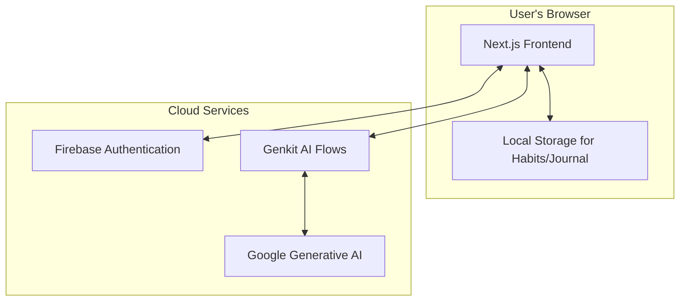

<div align="center">

**<h1>Unwinding: A Personal Wellness Sanctuary</h1>**

**Vyom Chaturvedi**  
**Roll No.:** [RA2411003011989]  
**Course:** [21CSC203T - Advanced Programming Practice]  
**Guide:** [Mrs. G Rekha]  
**Semester:** [3]  
**Institution:** [SRM Institute of Science And Technology]  
**Submission Date:** October 26, 2023

</div>

---
<div align="center">
**Samridhi Bhutani**  
**Roll No.:** [RA2411003012012]  
**Course:** [21CSC203T - Advanced Programming Practice]  
**Guide:** [Mrs. G Rekha]  
**Semester:** [3]  
**Institution:** [SRM Institute of Science And Technology]  
**Submission Date:** October 26, 2023

</div>

---

### **Abstract**

The Unwinding project aims to develop a comprehensive personal wellness sanctuary as a web application, specifically addressing the need for accessible mental health tools in India. The primary objective is to provide users with a private, secure, and culturally relevant platform for cultivating mindfulness and reflecting on their emotional well-being, particularly in a context where mental health resources are scarce. The methodology involves using a modern web stack, including Next.js for the frontend, Firebase for authentication, and Google's Genkit for generative AI features. The main result is a functional application featuring a mindful journaling system with AI-powered analysis, a habit tracker, a guided meditation space, and AI-generated reflection prompts. The application prioritizes user privacy by leveraging local storage, ensuring a personalized and secure user experience.

**Keywords**: Mental Wellness, Mindfulness, India, Next.js, Firebase, Generative AI.

---

### **1. Introduction / Background**

In today's fast-paced world, maintaining mental well-being is a global challenge, yet the accessibility of resources varies dramatically. In India, while awareness is growing, there remains a significant gap in the availability of accessible, private, and non-stigmatizing mental health tools. Many individuals seek ways to manage stress and engage in self-reflection but face cultural and logistical barriers. The Unwinding application is designed to address this gap by providing an all-in-one, private sanctuary for mental wellness, leveraging modern technology to create a supportive experience tailored for the Indian user.

### **2. Problem Statement**

In a country like India, where mental health resources are scarce and often stigmatized, there is a critical need for a private, user-centric, and comprehensive digital tool that integrates key wellness practices with personalized AI-driven insights, without compromising user data security.

### **3. Objectives**

The primary objectives of this project are to:
*   Develop a secure web application with user authentication using Firebase.
*   Implement a mindful journaling feature that allows users to create, edit, and delete entries, storing data client-side.
*   Create a habit tracking system for users to build good habits and quit bad ones, tracking streaks to maintain motivation.
*   Integrate generative AI using Genkit to provide users with daily reflection questions and analyze journal entries for emotional insights.
*   Design a simple, calming user interface using Tailwind CSS and ShadCN/UI components that promotes a sense of peace and focus.

### **4. Scope & Limitations**

**Scope:**
*   User authentication (signup, login, logout, password reset).
*   Full CRUD (Create, Read, Update, Delete) functionality for journal entries and habits.
*   AI-powered features for journal analysis and mood suggestions.
*   Client-side data storage for journal entries and habits using Browser Local Storage to ensure maximum user privacy.
*   Inclusion of India-specific mental health helpline resources.
*   Light and Dark mode theme support for user comfort.

**Limitations:**
*   The application is a web app and is not a native mobile application.
*   AI analysis is based on text input only and does not interpret other user data.
*   The application relies on an active internet connection for authentication and AI features.

### **5. Use Case Diagram**

```mermaid
graph TD
    actor User

    subgraph "Unwinding Application"
        UC1[Manage Account]
        UC2[Write & Manage Journal]
        UC3[Track Habits]
        UC4[Use Meditation Player]
        UC5[View AI Insights]
        UC6[View Resources]
        UC7[Change Theme]
    end

    User --|> UC1
    User --|> UC2
    User --|> UC3
    User --|> UC4
    User --|> UC5
    User --|> UC6
    User --|> UC7

    UC1 --> (Login/Signup)
    UC1 --> (Update Profile & Password)
    UC1 --> (Logout)
    UC2 --> (Create/Edit/Delete Entry)
    UC3 --> (Create/Edit/Delete Habit)
    UC3 --> (Mark Habit as Done)
    UC5 --> (Get Journal Analysis)
    UC5 --> (Get Mood Suggestions)
    UC7 --> (Toggle Light/Dark Mode)

    linkStyle 0,1,2,3,4,5,6 stroke:#444,stroke-width:2px
```

---

### **6. Technology Stack**

*   **Framework**: Next.js (v15) with App Router
*   **Language**: TypeScript
*   **Styling**: Tailwind CSS
*   **UI Components**: ShadCN/UI, Lucide React
*   **Generative AI**: Genkit (with Google's Gemini models)
*   **Backend & Authentication**: Firebase (Authentication)
*   **Client-side Storage**: Browser Local Storage
*   **Fonts**: Nunito & Lora (from Google Fonts)
*   **Theming**: `next-themes`

### **7. System Architecture**

The application employs a client-server architecture. The frontend is built with Next.js and React, rendering components on the server and client. Firebase provides secure user authentication. For AI features, client-side components make secure calls to server-side Genkit "flows," which then interface with the Google Generative AI API. **Crucially, sensitive user data like journal entries and habits are stored exclusively on the client-side in the browser's Local Storage to ensure maximum user privacy.** This design choice means data never leaves the user's device, making it a truly private sanctuary.



### **8. Data Model / Inputs & Outputs**

**Key Data Structures (stored in Local Storage):**

| Object        | Fields                                                      | Description                                         |
|---------------|-------------------------------------------------------------|-----------------------------------------------------|
| `Habit`       | `id`, `name`, `type` ('good'/'bad'), `createdAt`, `completedDates` | Represents a single user habit and its completion history. |
| `JournalEntry`| `id`, `content`, `tags`, `date`, `question`?                  | Represents a single journal entry with optional prompt. |

**AI Flows (Genkit):**

| Flow Name                      | Input(s)                             | Output(s)                                                                    |
|--------------------------------|--------------------------------------|------------------------------------------------------------------------------|
| `getDailyReflectionQuestion`   | None                                 | `{ question: string }`                                                       |
| `analyzeJournalEntries`        | `{ journalEntries: string[] }`       | `{ overallSentiment: string, emotionalTrends: string, mentalStateInsights: string }` |
| `getMoodSuggestions`           | `{ preferences: string[] }`          | `{ suggestions: string[] }`                                                  |

---

### **9. Step-by-Step Worked Procedure**

This section outlines the workflow of the application from the user's perspective, complemented by descriptions of the underlying technical implementation.

#### **Step 1: User Authentication Flow**

The user begins by either creating a new account or logging in.

1.  **UI**: The user interacts with the Signup or Login page (`src/app/signup/page.tsx` or `src/app/login/page.tsx`). These pages use forms built with React Hook Form for validation.
2.  **State Management**: The `useAuth` hook (from `src/hooks/use-auth.ts`) provides the `signup` or `login` functions from `AuthContext`.
3.  **Connectivity**: When the form is submitted, the `AuthContext` (`src/context/auth-context.tsx`) calls the appropriate Firebase Authentication function (`createUserWithEmailAndPassword` or `signInWithEmailAndPassword`).
4.  **Backend**: Firebase handles the authentication request, verifies the credentials, and returns a user session. The application state is updated, and the user is redirected to the dashboard.

<div align="center">
  
  <p><em>Figure 1: The user authentication flow, from UI to Firebase.</em></p>
</div>

#### **Step 2: Generating an AI Daily Reflection**

The dashboard presents the user with a unique daily reflection question.

1.  **UI**: The `DailyReflection` component (`src/components/dashboard/daily-reflection.tsx`) is rendered on the dashboard.
2.  **Connectivity**: Inside a `useEffect` hook, the component checks if a question for the current day already exists in local storage. If not, it calls the `getDailyReflectionQuestion` server function. The user can also request a new question by clicking the refresh button.
3.  **AI Flow**: This function, located at `src/ai/flows/get-daily-reflection-question.ts`, invokes a Genkit flow. The flow contains a highly specific prompt instructing the AI model to act as a compassionate wellness coach and generate a thought-provoking question, returning it as a structured JSON object.
4.  **Backend (Genkit)**: Genkit sends the prompt to the Google Gemini model. The model generates the question, and Genkit ensures it matches the defined output schema.
5.  **Response**: The question is returned to the `DailyReflection` component, which displays it to the user and saves it to local storage to prevent re-fetching on the same day unless requested.

<div align="center">
  
  <p><em>Figure 2: Step-by-step process of fetching an AI-generated question, with a user option to refresh.</em></p>
</div>

#### **Step 3: Storing a Habit (Client-Side)**

Once logged in, the user can track habits. This data is stored locally for privacy.

1.  **UI**: The user navigates to the Habits page (`src/app/(app)/habits/page.tsx`) and clicks "Add Habit", which opens a dialog (`src/components/habits/habit-dialog.tsx`).
2.  **State Management**: The state of all habits is managed by the `useLocalStorage` hook. This custom hook works like `useState` but persists the data to the browser's Local Storage.
3.  **Procedure**: When the user saves the new habit, the `onSave` function is called. This function updates the array of habits in the `useLocalStorage` state, which automatically serializes the array to a JSON string and saves it in Local Storage under the key "habits". The UI then automatically re-renders to display the new habit card.

<div align="center">
  
  <p><em>Figure 3: Diagram of the `useLocalStorage` hook managing habit data.</em></p>
</div>

#### **Step 4: AI-Powered Journal Analysis**

After writing at least three journal entries, the user can get AI-powered insights.

1.  **UI**: The user navigates to the Journal Analysis page (`src/app/(app)/journal/analysis/page.tsx`).
2.  **Data Fetching**: The component retrieves all journal entries from Local Storage using the `useLocalStorage` hook.
3.  **Connectivity**: When the user clicks the "Analyze My Journal" button, the contents of the journal entries are passed to the `analyzeJournalEntries` server function.
4.  **AI Flow**: This function at `src/ai/flows/analyze-journal-entries.ts` invokes a Genkit flow. It sends the user's journal text to the AI model with a prompt that asks it to identify overall sentiment, emotional trends, and mental state insights.
5.  **Response**: The structured analysis is returned and displayed in separate cards, giving the user a high-level overview of their recent emotional state.

<div align="center">
  
  <p><em>Figure 4: The process of analyzing journal entries with Genkit.</em></p>
</div>

#### **Step 5: Using the Meditation Player**

The app includes a simple, focused meditation player.

1.  **UI**: The user visits the Meditate page (`src/app/(app)/meditate/page.tsx`), which features the `MeditationPlayer` component.
2.  **Client-Side Logic**: The player is built using React state and the **Tone.js** library for audio synthesis. Tone.js generates ambient sounds like rain or forest noise procedurally, avoiding the need to load large audio files.
3.  **Functionality**: Users can select a duration for their meditation session (e.g., 5, 10, or 15 minutes) and choose an ambient background sound. The timer counts down, and the circular progress bar visually represents the time remaining.

<div align="center">
  
  <p><em>Figure 5: The meditation player with timer and sound options.</em></p>
</div>


#### **Step 6: Changing the Application Theme**

Users can switch between a light and dark theme for visual comfort.

1.  **UI**: A theme toggle button is located in the header of the dashboard (`src/app/(app)/dashboard/page.tsx`).
2.  **State Management**: The application uses the `next-themes` library. A `ThemeProvider` is wrapped around the root layout (`src/app/layout.tsx`). The `useTheme` hook is used in the `ThemeToggle` component (`src/components/shared/theme-toggle.tsx`) to access and change the current theme.
3.  **Procedure**: When the user clicks the toggle, `setTheme` is called with 'light', 'dark', or 'system'. This updates the `data-theme` attribute on the `<html>` element, and the CSS variables defined in `src/app/globals.css` apply the appropriate color scheme.

<div align="center">
  
  <p><em>Figure 6: The mechanism for toggling between light and dark themes.</em></p>
</div>

#### **Step 7: Accessing Localized Resources**

Recognizing the target demographic, the app provides a curated list of mental health resources in India.

1.  **UI**: The user navigates to the Resources page (`src/app/(app)/resources/page.tsx`).
2.  **Data Source**: The page contains a hardcoded array of Indian mental health organizations, including their descriptions, phone numbers, and websites.
3.  **Display**: This data is mapped over to render a series of `Card` components, each providing clear and actionable information for a user in need of immediate help. This approach ensures that critical information is always available without relying on external APIs.

<div align="center">
  
  <p><em>Figure 7: The Resources page displaying India-specific helplines.</em></p>
</div>

    
